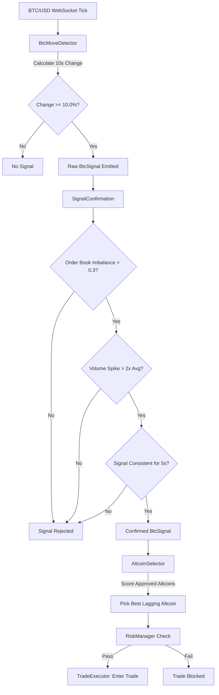

# Lead-Lag Trading Bot — Architecture Plan

## 1. Goal & Core Concept

Detect sharp BTC moves first → enter lagging altcoins before they catch up → exit on TP/SL/time/reversal. Built as a new module in the existing Kraken trading bot, reusing the existing `SpotTickerWebSocketService`, `KrakenWebSocketClient`, `KrakenRestClient`, and `TradingConfig`.

---

## 2. Full Package Structure

All Lead-Lag code lives under a single new package, keeping the existing arbitrage code untouched.

```
cloudcode.krakenfutures.leadlag/
│
├── LeadLagOrchestrator.java              # Top-level coordinator (lifecycle, wiring)
│
├── config/
│   └── LeadLagConfig.java                 # Lead-Lag-specific thresholds + altcoin list
│
├── signal/
│   ├── BtcMoveDetector.java               # 10-sec rolling window, +1.5% / -1.5% detection
│   ├── SignalConfirmation.java            # Imbalance + volume + 5-sec consistency gate
│   ├── SignalType.java                    # Enum: BULLISH, BEARISH, NONE
│   └── BtcSignal.java                     # Immutable signal record (direction, ts, magnitude)
│
├── monitor/
│   ├── BtcOrderBookMonitor.java           # Maintains BTC L2 book, computes imbalance
│   ├── BtcVolumeMonitor.java              # Maintains rolling volume, detects 2x spike
│   └── AltcoinLagMonitor.java             # Tracks altcoin 10-sec change for lag detection
│
├── selector/
│   ├── AltcoinSelector.java               # Scores + ranks candidate altcoins
│   ├── CorrelationTracker.java            # Daily BTC-vs-altcoin Pearson correlation
│   ├── AltcoinCandidate.java              # Per-altcoin score breakdown
│   └── ApprovedAltcoins.java              # Dynamic discovery of all fiat-paired altcoins
│
├── trade/
│   ├── TradeExecutor.java                 # Market-order placement (spot buy / perp short)
│   ├── PositionManager.java               # Active-position lifecycle (entry → exit)
│   ├── Position.java                      # Open-position state (side, entry, qty, pnl)
│   ├── ExitReason.java                    # Enum: TAKE_PROFIT, STOP_LOSS, TIMEOUT, REVERSAL, MANUAL
│   └── TradeResult.java                   # Closed-position record for logging
│
├── risk/
│   ├── RiskManager.java                   # Top-level risk gate (max trades, cooldown, size)
│   └── CooldownTracker.java               # 60-sec post-trade pause per asset
│
└── model/
    └── (shared records reused from signal/, trade/)
```

### Reused existing components (no changes required)
- [`cloudcode.krakenfutures.websocket.SpotTickerWebSocketService`](CloudRunBot/src/main/java/cloudcode/krakenfutures/websocket/SpotTickerWebSocketService.java:31) — ticker feed (BTC + altcoins)
- [`cloudcode.krakenfutures.websocket.KrakenWebSocketClient`](CloudRunBot/src/main/java/cloudcode/krakenfutures/websocket/KrakenWebSocketClient.java:27) — order placement (private WS)
- [`cloudcode.krakenfutures.rest.KrakenRestClient`](CloudRunBot/src/main/java/cloudcode/krakenfutures/rest/KrakenRestClient.java:31) — REST endpoints (order book fallback, instrument metadata)
- [`cloudcode.krakenfutures.config.TradingConfig`](CloudRunBot/src/main/java/cloudcode/krakenfutures/config/TradingConfig.java:37) — env-driven base config + `ENABLE_LEADLAG` flag

---

## 3. Class Responsibilities

| Class | Responsibility |
|-------|----------------|
| `LeadLagOrchestrator` | Wires all components, owns the lifecycle (start/stop), subscribes/unsubscribes WebSocket channels, routes events between detector → confirmer → selector → executor. Single source of truth for "is a trade in flight?". |
| `LeadLagConfig` | Loads Lead-Lag-specific env vars (`BTC_MOVE_THRESHOLD_PCT`, `ALTCOIN_LIST`, `POSITION_SIZE_EUR`, `TP_PCT`, `SL_PCT`, `HOLD_TIMEOUT_SEC`, `COOLDOWN_SEC`, etc.). Provides sensible defaults. |
| `BtcMoveDetector` | Maintains a sliding 10-sec price window for BTC/USD. On every BTC tick: compute `btcChange = (now - price10sAgo) / price10sAgo`. Emits raw `BtcSignal` when `|change| >= 10.0%`. |
| `SignalConfirmation` | Receives raw signals and gates them with three filters: order-book imbalance > 0.3, volume spike > 2x rolling average, signal-direction consistency for 5 sec. Emits confirmed signals only. |
| `BtcOrderBookMonitor` | Maintains BTC L2 order book from WebSocket `book` channel. Computes imbalance = `(bidVol - askVol) / (bidVol + askVol)` for top N levels. |
| `BtcVolumeMonitor` | Maintains rolling 1-min BTC trade volume. Spike detected when current 10-sec volume > 2x the average 10-sec volume over the last 5 minutes. |
| `AltcoinLagMonitor` | For each approved altcoin, tracks last 10-sec price change. Used by selector to penalize altcoins that have already moved (lagging = hasn't moved yet). |
| `CorrelationTracker` | Computes daily Pearson correlation between BTC and each altcoin using 1-min closes. Refreshed every 5 min via REST `OHLC` endpoint. |
| `AltcoinSelector` | On confirmed signal, scores each approved altcoin: `score = w1*correlation + w2*liquidity + w3*lagBonus - w4*spreadPenalty`. Returns top candidate. |
| `TradeExecutor` | Places market orders via `KrakenWebSocketClient` (Spot buy for BULLISH, Futures/Perp short for BEARISH). Handles paper trading mode. |
| `PositionManager` | Tracks active position. Monitors real-time price of the traded altcoin. Triggers exit when TP (+1.5%), SL (-0.8%), timeout (90s), or BTC signal reversal occurs. |
| `RiskManager` | Enforces global risk rules: max concurrent trades (1), daily drawdown limit, position size validation, and cooldown checks. |
| `CooldownTracker` | Tracks per-asset cooldowns. Enforces a 60-second pause after any trade exit before that asset can be traded again. |

---

## 4. Signal Detection Flow Diagram



---

## 5. Kraken WebSocket Feeds Needed

To support the Lead-Lag bot, we subscribe to the following Kraken WebSocket v2 channels:

1. **BTC/USD Ticker Feed** (`ticker` channel, symbol `BTC/USD` or `XBT/USD`):
   - Used for real-time BTC price updates in `BtcMoveDetector`.
2. **BTC/USD Order Book Feed** (`book` channel, symbol `BTC/USD` or `XBT/USD`, depth `10` or `25`):
   - Used by `BtcOrderBookMonitor` to calculate real-time bid-ask volume imbalance.
3. **BTC/USD Trade Feed** (`trade` channel, symbol `BTC/USD` or `XBT/USD`):
   - Used by `BtcVolumeMonitor` to track real-time volume spikes.
4. **Altcoin Ticker Feeds** (`ticker` channel, symbols: `ETH/USD`, `SOL/USD`, `XRP/USD`, `ADA/USD`, `DOGE/USD`, `LTC/USD`):
   - Used by `AltcoinLagMonitor` to track lag and by `PositionManager` to monitor active trade PnL.
5. **Altcoin Order Book Feeds** (`book` channel, depth `10`):
   - Used by `AltcoinSelector` to verify that the spread is `< 0.3%` before entering.

---

## 6. Risk Rules List

The bot enforces strict risk rules to protect capital and prevent runaway losses:

1. **Single Active Position Limit**:
   - Maximum of 1 active trade at any time. No new trades are entered if a position is already open.
2. **Strict Cooldown Period**:
   - A 60-second pause is enforced after each trade exit. No trades can be entered during this cooldown.
3. **Hard Stop Loss (Fee-Adjusted)**:
   - Every trade has a strict stop loss of `-0.8%` from the entry price, calculated **net of round-trip fees** (0.80% total for spot). Market orders are sent immediately upon breach.
4. **Take Profit (Fee-Adjusted)**:
   - Every trade has a profit target of `+1.5%` calculated **net of round-trip fees** (0.80% total for spot).
5. **Max Hold Time Limit**:
   - A hard timeout of 90 seconds is enforced. If neither TP nor SL is hit within 90 seconds, the position is closed via market order.
5. **BTC Signal Reversal Exit**:
   - If the bot is long an altcoin and the BTC signal reverses to BEARISH (or vice versa), the position is closed immediately.
6. **Spread Protection**:
   - Do not trade any altcoin if its current bid-ask spread is `>= 0.3%` to avoid excessive slippage.
7. **Liquidity Filter**:
   - Do not trade if the top-of-book liquidity is below €5,000 equivalent.
8. **Daily Drawdown Limit**:
   - If cumulative daily loss exceeds 3% of the starting balance, the bot halts all trading and alerts the operator.
9. **Paper Trading Safety**:
   - Default mode is `PAPER`. Real orders are only placed if `TRADING_MODE=live` is explicitly set.
